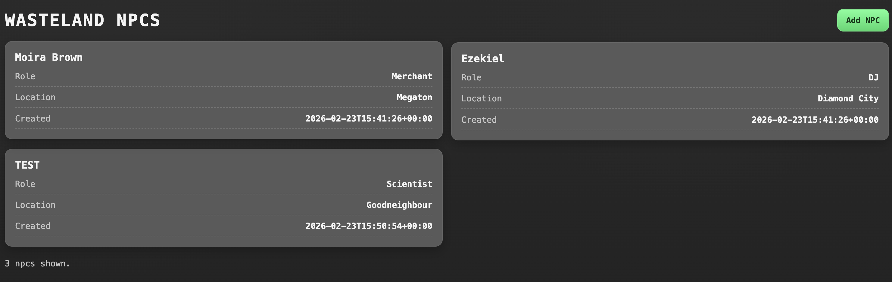
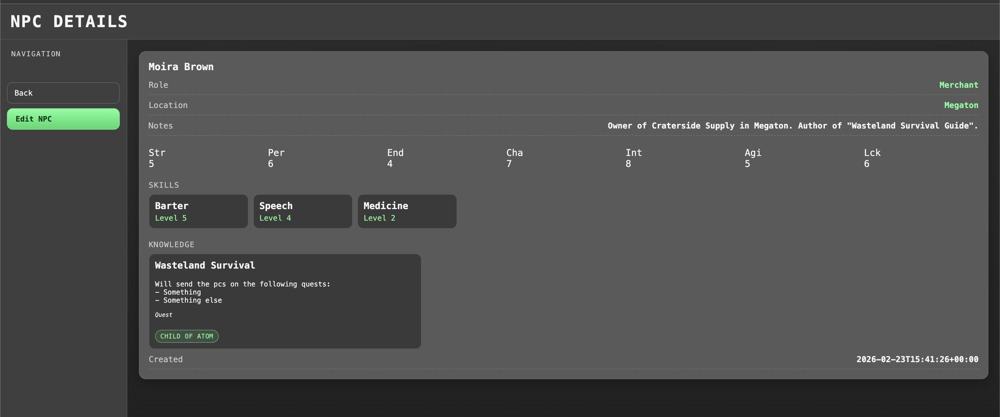
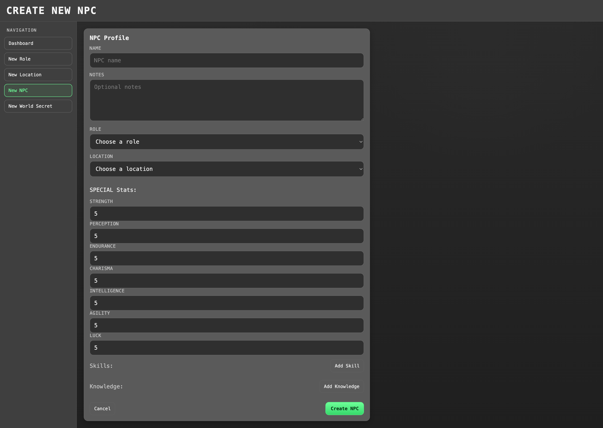
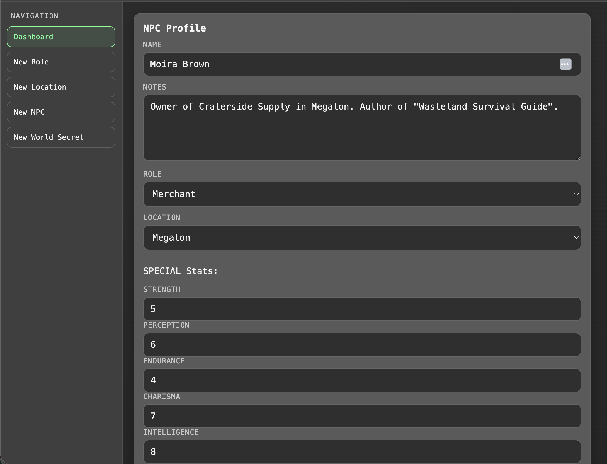

# Wasteland Dashboard (Symfony + Vue)

A lightweight GM “notebook” for managing locations, NPCs, roles, skills, knowledge, and world secrets.
Built to demonstrate Symfony + Doctrine domain modelling (explicit relationships, pivot entities, embeddables) with a small Vue dashboard consuming a JSON API.

## Key ideas

- **Notebook, not an engine**: narrative notes (Knowledge) are separate from canon plot points (WorldSecrets).
- **Explicit Doctrine modelling**: `NpcSkill` is a first-class pivot entity (skill + level), and `SpecialStats` is an embedded value object.
- **Backend-first UI**: Symfony Forms + Twig for CRUD pages; Vue is used for the dashboard list/filter UX.

## Prerequisites

- Docker + Docker Compose

## Tech stack

- **Backend:** PHP 8.4+, Symfony 8.0
- **Persistence:** Doctrine ORM 3.6 + DBAL 4.4, Doctrine Migrations
- **UI:** Twig + Symfony Forms (CRUD pages), Vue 3 (dashboard)
- **Testing:** PHPUnit 13
- **Dev tooling:** Docker Compose

## Running with Docker

1. Build and start containers:

```bash
docker compose up -d --build
```

2. Install PHP dependencies (first run):

```bash
docker compose exec npc-store-runtime composer install
```

3. Run database migrations:

```bash
docker compose exec npc-store-runtime php bin/console doctrine:migrations:migrate --no-interaction
```

4. (Optional) Load fixtures:

```bash
docker compose exec npc-store-runtime php bin/console doctrine:fixtures:load --no-interaction
```

5. Open the app:

- Frontend dashboard: `http://localhost:8080/`

### How to reset

```bash
docker compose down -v
```

## Project structure

- `src/Entity` — Doctrine entities + embeddables (e.g. `SpecialStats`)
- `src/Repository` — QueryBuilder-based repositories
- `src/Form` — Symfony Form types (including collections for skills/knowledge)
- `src/Controller` — HTML controllers + JSON API controllers
- `templates/` — Twig templates
- `public/components/` — Vue SFCs for the dashboard
- `public/js/` — Vue bootstrap/loader

## Frontend

- Main dashboard: `/`
- Entity detail pages:
  - `/locations/{id}`
  - `/npcs/{id}`
  - `/roles/{id}`
  - `/worldsecrets/{id}`
- Create/update forms:
  - `/locations/new`, `/locations/{id}/update`
  - `/npcs/new`, `/npcs/{id}/update`
  - `/roles/new`, `/roles/{id}/update`
  - `/worldsecrets/new`, `/worldsecrets/{id}/update`

## Frontend approach

The dashboard (`/`) uses a small Vue 3 app to provide fast entity switching and client-side filtering.
CRUD pages (create/update) and detail pages are rendered server-side using Twig + Symfony Forms.

## Core Entities and Relationships

- `Location`
  - Fields: `name`, `defence`, `food`, `morale`, `standing`
  - Relationships:
    - One `Location` has many `Npc`

- `Role`
  - Fields: `name`, `description`
  - Relationships:
    - One `Role` has many `Npc`

- `Npc`
  - Fields: `name`, `notes`, `createdAt`, `updatedAt`
  - Embedded value object:
    - `SpecialStats` (`strength`, `perception`, `endurance`, `charisma`, `intelligence`, `agility`, `luck`)
  - Relationships:
    - Many `Npc` belong to one `Role` (optional)
    - Many `Npc` belong to one `Location` (optional)
    - One `Npc` has many `NpcSkill` entities
    - One `Npc` has many `Knowledge` entities

- `Skill`
  - Fields: `name`, `description`
  - Relationships:
    - One `Skill` has many `NpcSkill` entities

- `NpcSkill` (pivot/catalog assignment)
  - Fields: `level`
  - Relationships:
    - Many `NpcSkill` belong to one `Npc`
    - Many `NpcSkill` belong to one `Skill`

- `Knowledge`
  - Fields: `title`, `description`, `category`
  - Relationships:
    - Many `Knowledge` belong to one `Npc`
    - Many `Knowledge` belong to one `WorldSecret` (optional)

- `WorldSecret`
  - Fields: `title`, `description`, `category`
  - Relationships:
    - One `WorldSecret` has many `Knowledge` entities

## API Endpoints (JSON)

All primary entities expose full REST-style endpoints.

### Health
- `GET /api/health`

### Locations
- `GET /api/locations`
- `GET /api/locations/{id}`
- `GET /api/locations/{id}/npcs`
- `POST /api/locations`
- `PUT /api/locations/{id}`
- `DELETE /api/locations/{id}`

### NPCs
- `GET /api/npcs`
- `GET /api/npcs/{id}`
- `POST /api/npcs`
- `PUT /api/npcs/{id}`
- `PUT /api/npcs/{id}/location` (move NPC between locations)
- `DELETE /api/npcs/{id}`

### Roles
- `GET /api/roles`
- `GET /api/roles/{id}`
- `POST /api/roles`
- `PUT /api/roles/{id}`
- `DELETE /api/roles/{id}`

### World Secrets
- `GET /api/worldsecrets`
- `GET /api/worldsecrets/{id}`
- `POST /api/worldsecrets`
- `PUT /api/worldsecrets/{id}`
- `DELETE /api/worldsecrets/{id}`

## Tests

Run controller tests:

```bash
docker compose exec npc-store-runtime php bin/phpunit tests/Controller
```

## Images

- Dashboard



- Entity Screen



- New Entity Form



- Update Entity Form


